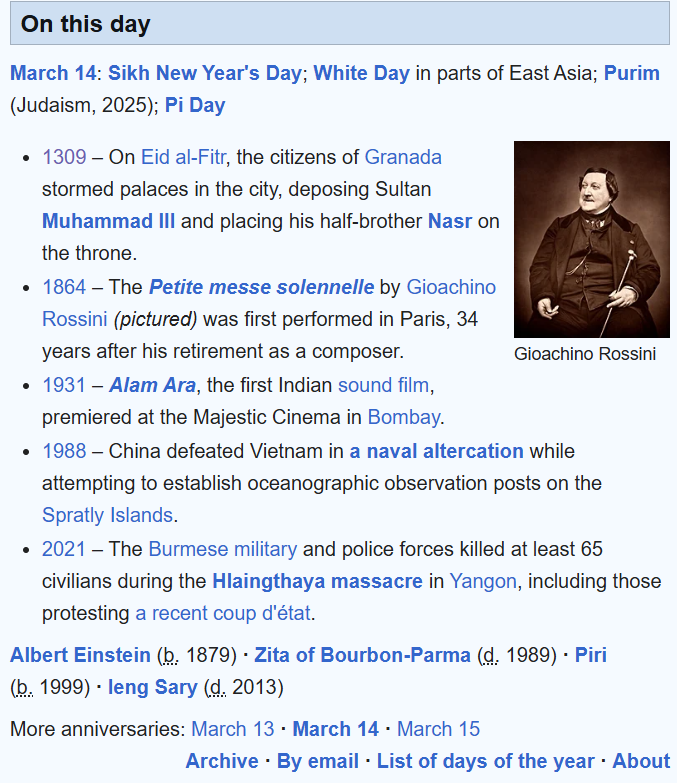
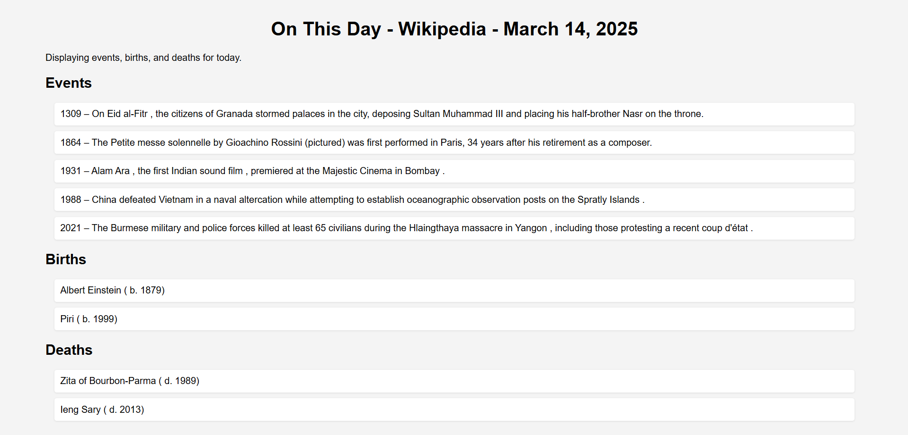

# About
This project is a web scraper created with Python and AWS that displays events that happened on today's date. The content will be updated daily to reflect the current date. Users will also be able to access previously scraped "on this day" articles.

# Installation
1. Create a virtual environment to run the project. To create and activate a virtual environment, run:
   ```sh
   python -m venv venv
   venv\Scripts\activate  # or source venv/bin/activate
   ```
2. To install all the dependencies, run:
   ```sh
   pip install -r requirements.txt
   ```
3. Create an S3 bucket with a unique name where the JSON results from the web scraping will be stored. Edit the bucket name inside the `index.html` file and `lambda_function.py` file accordingly. Make the S3 bucket publicly accessible and add the policy below to make the objects accessible:
   ```json
   {
      "Version": "2012-10-17",
      "Statement": [
         {
            "Effect": "Allow",
            "Principal": "*",
            "Action": "s3:GetObject",
            "Resource": "arn:aws:s3:::your-unique-bucket-name/*"
         }
      ]
   }
   ```
4. Configure the CORS with:
   ```json
   [
       {
           "AllowedHeaders": [
               "*"
           ],
           "AllowedMethods": [
               "GET",
               "HEAD"
           ],
           "AllowedOrigins": [
               "*"
           ],
           "ExposeHeaders": [],
           "MaxAgeSeconds": 3000
       }
   ]
   ```
5. Package the `lambda_function.py` file with the `web_scraper.py` file along with the installed libraries, and upload it to AWS Lambda using Python as the runtime. Make sure to also increase the timeout duration of the Lambda function.
6. Create a new rule on AWS EventBridge to trigger the Lambda function at a specific time/interval.
7. Upload the HTML file located under the `app` directory to the same S3 bucket where the scraped JSON files will be uploaded. On the S3 bucket, create an `app` directory and upload the `index.html` file inside that directory.

# Example
## Wikipedia Page


## Scraped Website
